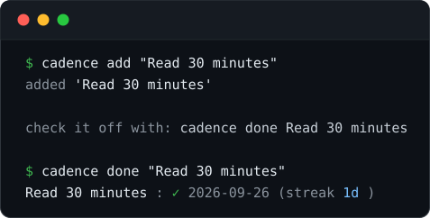
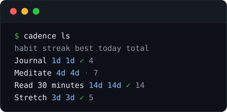
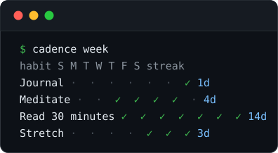

# cadence

A tiny habit tracker that lives in your terminal and keeps your streaks on your machine.

No accounts. No cloud. No sync. One command to check off your day.

> **Beta** — cadence is `0.1.0b1`: stable enough to live with daily, but the
> data format and CLI may still change as it matures.

## What it looks like

Quick start — add a habit, then check it off:



`cadence ls` — every habit with its streak, best streak, today, and total:



`cadence week` — the last seven days at a glance:



## Install

```sh
pip install git+https://github.com/workforit119-eng/cadence.git
```

Requires Python 3.9+.

## Quick start

```sh
$ cadence add "Read 30 pages"
$ cadence done "Read 30 pages"
Read 30 pages: ✓ 2026-09-26  (streak 1d)

$ cadence ls
habit         streak  best  today  total
Read 30 pages 1d     1d   ✓      1

$ cadence week
habit         M T W T F S S  streak
Read 30 pages · · · · · · ✓  1d
```

## Commands

| Command | What it does |
| --- | --- |
| `cadence add NAME [NAME ...]` | Add one or more habits |
| `cadence done NAME [DATE]` | Check a habit off (default: today) |
| `cadence undo NAME [DATE]` | Uncheck a habit (default: today) |
| `cadence ls` | List habits with current/best streak |
| `cadence week` | Last 7 days for every habit |
| `cadence stats NAME` | Detailed stats for one habit |
| `cadence rm NAME` | Delete a habit (asks first) |
| `cadence path` | Show where your data file lives |

Every command accepts `--json` for machine-readable output, `--file PATH` to
use a different data file, and `--today YYYY-MM-DD` to override the date
(useful for back-filling and testing).

### Streak rules

- A streak counts consecutive done-days ending **today**.
- If you haven't checked off today yet, your streak still counts from
  yesterday — the day isn't broken until it's over.
- `best` is the longest run you've ever had.

### Scripting

```sh
$ cadence done "Stretch" --json
{"habit": "Stretch", "date": "2026-09-26", "streak": 4}

$ cadence ls --json | jq '.[0].streak'
4
```

### Back-filling

```sh
$ cadence done "Read 30 pages" 2026-09-25
$ cadence undo "Read 30 pages" 2026-09-25
```

## Your data

One plain-JSON file, human-readable and easy to back up:

- Linux/macOS: `~/.local/share/cadence/cadence.json`
- Windows: `%APPDATA%\cadence\cadence.json`

Override with `--file PATH` or the `CADENCE_FILE` environment variable.

## Development

```sh
pip install -e .[dev]
pytest
```

## License

MIT — see [LICENSE](LICENSE).
